# VirtualizationLaboratorio

Este repositorio contiene una aplicación web pequeña hecha en Java con Spring Boot, que expone un único endpoint de saludo. A partir de ahí se fue armando todo el recorrido del taller: empaquetar la app como imagen Docker, correrla en varios contenedores aislados al mismo tiempo, orquestarla junto a una base de datos con Docker Compose, publicar la imagen en Docker Hub y finalmente desplegarla en una instancia real de AWS EC2.

## Propósito

El objetivo de este taller es entender la virtualización como mecanismo de modularidad, aislamiento, portabilidad y despliegue. No se trata solo de que la app funcione, sino de ver en la práctica qué gana uno al contenerizar algo: se puede mover la misma imagen de la máquina local a la nube sin cambiar una línea de código, se pueden correr varias copias aisladas entre sí, y se puede razonar sobre el costo real de tener eso corriendo en producción.

## Arquitectura y diseño

La aplicación es deliberadamente simple, dos clases nada más:

- `RestServiceApplication` es la clase principal, anotada con `@SpringBootApplication`. Lee el puerto de escucha desde la variable de entorno `PORT`, y si esa variable no está definida, usa 9000 por defecto.
- `HelloRestController` es el controlador REST. Expone un solo endpoint, `GET /greeting`, que recibe un parámetro opcional `name` (por defecto `World`) y responde con un saludo tipo `Hello, {name}!`.

```
co.edu.eci.virtualizationlaboratorio
├── RestServiceApplication.java   (punto de entrada, configuración de puerto)
└── HelloRestController.java      (endpoint /greeting)
```

El stack completo usado en el taller es: Java 21, Maven, Spring Boot 4.1.1, Docker y Docker Compose, MongoDB 8, la imagen base Amazon Corretto 21 para el contenedor, y una instancia EC2 con Amazon Linux 2023 para el despliegue final.

## Cómo construir y correr localmente

```bash
mvn clean package
java -jar target/*.jar
```

Con la app corriendo, se puede probar el endpoint directamente en el navegador o con curl:

```
http://localhost:9000/greeting?name=Pedro
```

La respuesta esperada es `Hello, Pedro!`.

Evidencia de la ejecución local, la app respondiendo en el navegador:

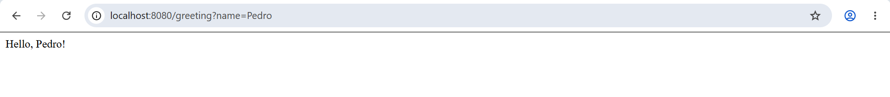

Y la misma prueba hecha con curl desde la terminal:

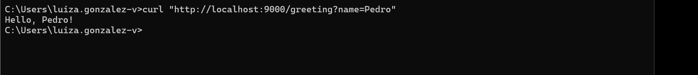

## Cómo correr en Docker

Para construir la imagen a partir del `Dockerfile` del repo:

```bash
docker build -t marianaveloza/virtualization-lab:1.0 .
```

Y para correr un contenedor a partir de esa imagen, mapeando el puerto interno 9000 a un puerto cualquiera del host:

```bash
docker run -d --name virtualization-lab-1 -p 34000:9000 marianaveloza/virtualization-lab:1.0
```

Evidencia de los comandos usados durante el build:

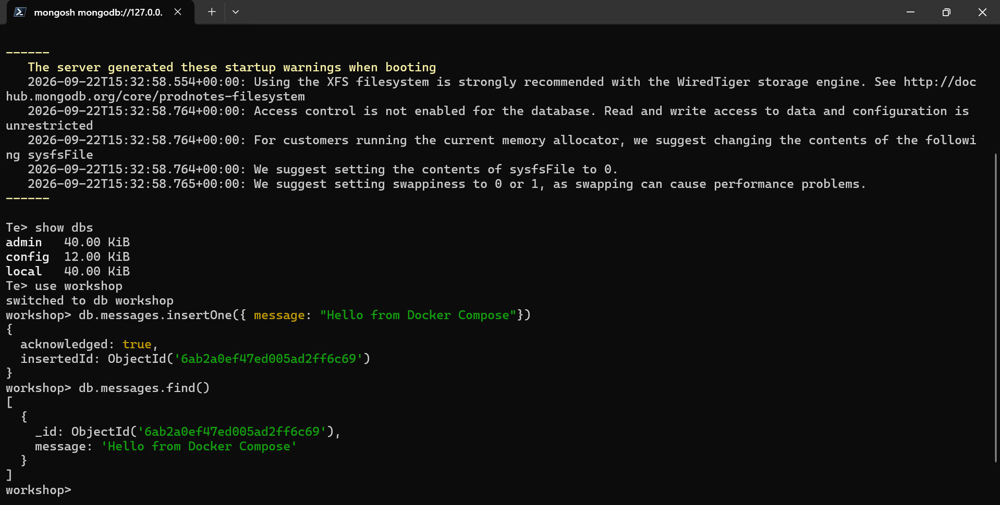

Y evidencia de que la imagen quedó construida correctamente:

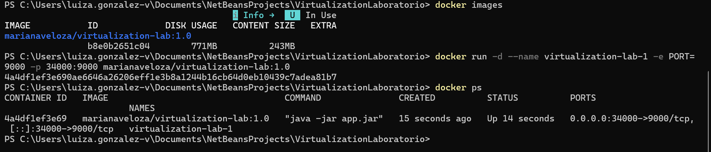

### Aislamiento entre contenedores

Para comprobar que cada contenedor corre completamente aislado del resto, aunque compartan la misma imagen base, se levantaron tres instancias al mismo tiempo (`virtualization-lab-1`, `-2` y `-3`), cada una mapeada a un puerto distinto del host: 34000, 34001 y 34002 respectivamente. Los tres respondieron de forma independiente, sin interferirse entre sí, que es justamente lo que se espera de la contenerización: cada proceso vive en su propio espacio aislado, aunque técnicamente sean copias del mismo software.

Evidencia de los tres contenedores corriendo en paralelo:

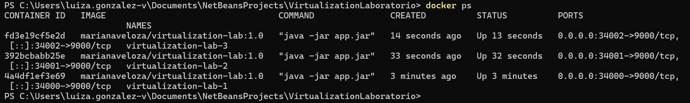

Y evidencia de que cada uno responde por separado en su propio puerto:

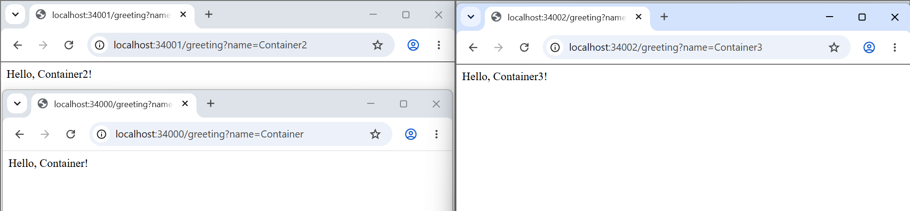

## Cómo correr con Docker Compose (app + MongoDB)

```bash
docker compose up -d --build
```

Este comando levanta dos servicios a la vez, definidos en `compose.yaml`:

- `web` es la aplicación Spring Boot, expuesta en el puerto 8087 del host (que internamente mapea al 9000 del contenedor).
- `db` es MongoDB 8, expuesto en el puerto 27017, con dos volúmenes persistentes (`mongodb` y `mongodb_config`) que guardan los datos de forma independiente del ciclo de vida del contenedor de base de datos. Es decir, si el contenedor de Mongo se borra y se vuelve a crear, los datos siguen ahí.

Vale aclarar que la aplicación todavía no persiste nada en MongoDB. El servicio de base de datos se agregó al `compose.yaml` con un propósito puramente pedagógico: entender cómo Docker Compose administra varios servicios a la vez, cómo se comunican entre sí por red interna (los contenedores se alcanzan entre ellos usando el nombre del servicio, en este caso `db`, como si fuera un hostname), y cómo funcionan los volúmenes persistentes.

Evidencia de ambos servicios corriendo:

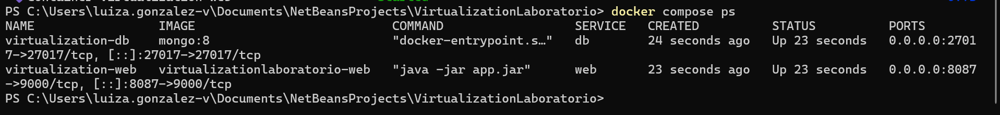

Y del endpoint de la app respondiendo a través de Compose:

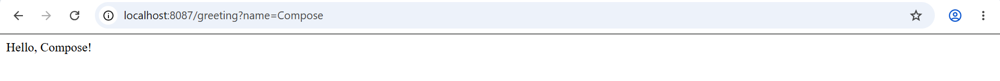

Para comprobar que MongoDB funciona, se entró a su shell interactiva desde dentro del propio contenedor:

```bash
docker compose exec db mongosh
```

Y ahí dentro se creó una base de prueba, se insertó un documento y se consultó de vuelta:

```javascript
use workshop
db.messages.insertOne({ message: "Hello from Docker Compose" })
db.messages.find()
```

Evidencia de esa inserción y consulta:

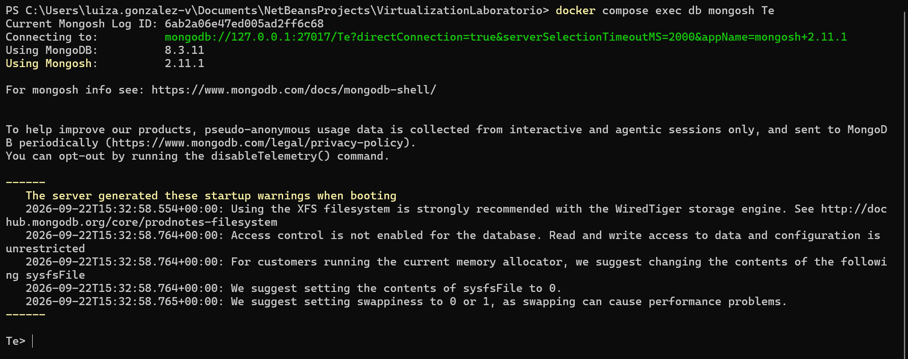

## Publicación en Docker Hub

La imagen quedó publicada en el siguiente repositorio: [hub.docker.com/r/marianaveloza/virtualization-lab](https://hub.docker.com/r/marianaveloza/virtualization-lab), con dos tags disponibles, `1.0` y `latest`.

Evidencia del repositorio publicado:

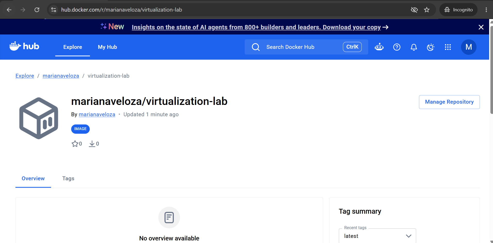

Y evidencia de los tags disponibles:

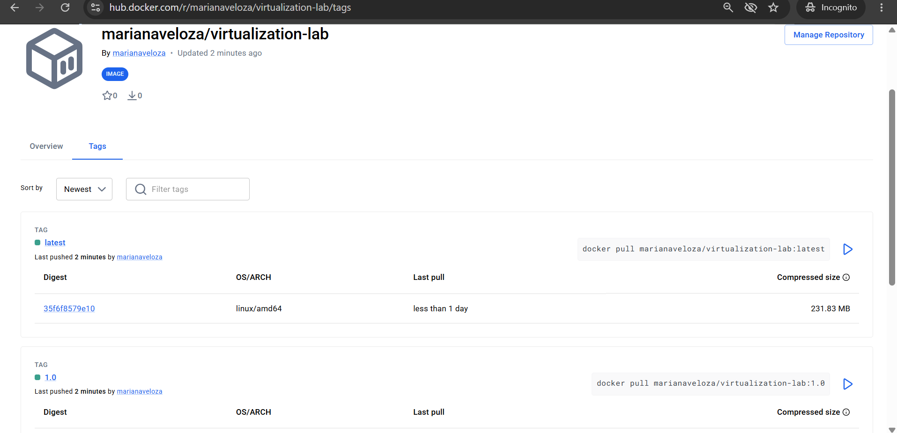

## Despliegue en AWS EC2

El despliegue se hizo sobre una instancia `t3.micro` con Amazon Linux 2023, donde Docker se instaló manualmente usando el gestor de paquetes `yum`. El security group de la instancia se configuró de forma restrictiva a propósito: el puerto 22 (SSH) solo acepta conexiones desde la IP propia, mientras que el puerto 8080, que es por donde se expone la aplicación, sí queda abierto al público para poder probar el servicio desde cualquier lado.

Una vez dentro de la instancia por SSH, se descargó la imagen publicada y se corrió el contenedor así:

```bash
docker pull marianaveloza/virtualization-lab:1.0
docker run -d --name virtualization-lab --restart unless-stopped \
  -e PORT=9000 -p 8080:9000 marianaveloza/virtualization-lab:1.0
```

La URL pública donde quedó corriendo el servicio es:

`http://54.164.85.248:8080/greeting?name=AWS`

Vale la pena aclarar algo sobre esa IP: como la instancia no tiene una Elastic IP asignada, la dirección pública puede cambiar si la instancia se detiene y se vuelve a encender. Si en algún momento ese link deja de responder, probablemente sea por eso y no porque el despliegue haya fallado.

Evidencia del endpoint respondiendo desde la instancia de EC2:

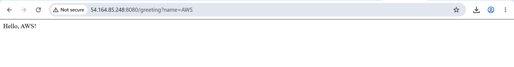

Y evidencia del contenedor corriendo dentro de la instancia:

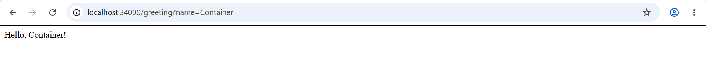

## Modelo de despliegue

El flujo completo de una solicitud, desde que sale del cliente hasta que llega a la aplicación, se puede resumir así:

```
Cliente
  ↓ Solicitud HTTP
Máquina virtual EC2 (Amazon Linux 2023, t3.micro)
  ↓
Docker Engine
  ↓
Contenedor de la aplicación web Java (Spring Boot con Tomcat embebido)
```

Cada capa cumple un rol distinto. La instancia EC2 es la que provee los recursos aislados de cómputo, memoria, almacenamiento y red, y se paga por hora de uso independientemente de cuánto tráfico reciba. Docker Engine es el motor que corre sobre esa máquina y se encarga de levantar el contenedor. El contenedor en sí es un entorno de ejecución portable que ya trae empaquetada tanto la aplicación como todas sus dependencias de runtime, así que no importa en qué máquina se corra, siempre va a comportarse igual. Y finalmente, dentro de ese contenedor vive la aplicación Java, que es la que realmente procesa la solicitud HTTP y devuelve la respuesta. El security group, aunque no aparece como una capa de ejecución propiamente, es el que decide qué tráfico entrante puede siquiera llegar a tocar la máquina virtual.

## Análisis de costos

Antes de ver la tabla, conviene aclarar un par de decisiones que se tomaron para poder hacer esta estimación. La AWS Pricing Calculator no ofrecía `t3.micro` como instancia seleccionable en la región que se estaba usando al momento de hacer el cálculo, así que los números de esta tabla están calculados usando `t3.medium` como referencia. La instancia real que está corriendo en EC2 sí es una `t3.micro`, que es más pequeña y por lo tanto más barata que lo que muestra la tabla, así que estos valores deben tomarse como un techo, no como el costo exacto. Además, la calculadora quedó configurada en la región US East (Atlanta) en vez de US East (N. Virginia), que es donde realmente vive la instancia, pero la diferencia de precio entre ambas regiones dentro de US East es mínima y no cambia las conclusiones del análisis.

Evidencia de la estimación hecha en la AWS Pricing Calculator:

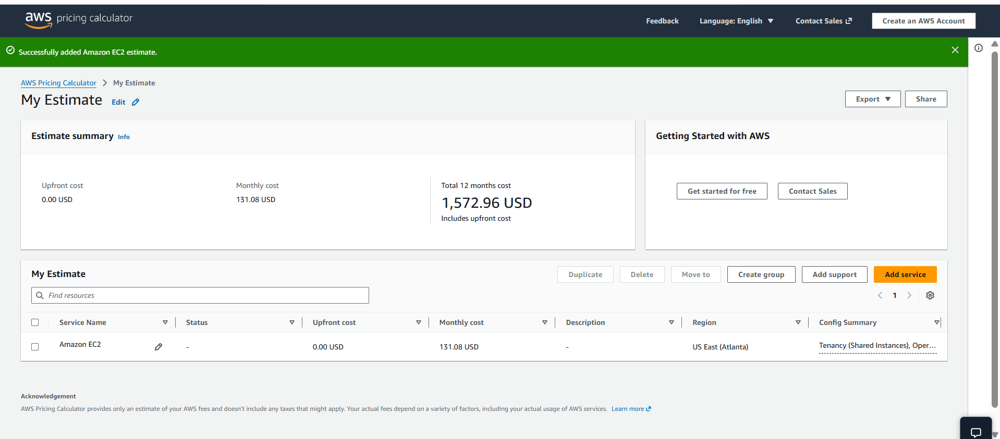

Los tres escenarios comparten algunos supuestos de base: la aplicación corre de forma continua, las 730 horas que tiene un mes en promedio, el almacenamiento usado es EBS tipo gp3, y la tarifa aplicada es on demand, sin ningún tipo de reserva ni compromiso de uso a futuro. También vale la pena notar que como el endpoint `/greeting` devuelve apenas un texto corto, la transferencia de datos es prácticamente insignificante en el costo total, incluso en el escenario de mayor tráfico.

| Escenario | Solicitudes al mes | Instancias | Horas al mes | Almacenamiento EBS | Transferencia saliente | Costo mensual estimado | Costo por solicitud | Principal factor de costo |
|---|---|---|---|---|---|---|---|---|
| Carga pequeña | 10,000 | 1 x t3.medium | 730 | 8 GB | aprox. 1 GB | aprox. 38.69 USD | aprox. 0.00387 USD | El tiempo de ejecución de la instancia, que es un costo fijo |
| Carga media | 100,000 | 1 x t3.medium | 730 | 10 GB | aprox. 5 GB | aprox. 39.21 USD | aprox. 0.00039 USD | El tiempo de ejecución de la instancia, que sigue siendo el costo fijo |
| Carga grande | 1,000,000 | 2 x t3.medium | 730 cada una | 20 GB cada una | aprox. 50 GB | aprox. 83.62 USD | aprox. 0.00008 USD | La capacidad adicional agregada para tener alta disponibilidad |

Si al revisar tu propia captura de la calculadora te dieron números distintos, actualiza la tabla con esos valores, la lógica de fondo y el orden de magnitud se van a mantener igual de todas formas.

### Discusión arquitectónica

Por qué un despliegue en EC2 tiene un costo base incluso con pocas solicitudes: la razón es que se está pagando por tener la máquina encendida y reservada, no por cada solicitud que se procesa. Una instancia `t3.medium` corriendo las 730 horas de un mes cuesta exactamente lo mismo si recibe diez solicitudes que si recibe diez mil, porque el cómputo, la memoria y el almacenamiento están disponibles todo ese tiempo, se usen o no a plena capacidad.

En qué nivel de carga ese costo fijo deja de pesar tanto: en la tabla se nota clarísimo. El costo por solicitud cae de unos 0.0039 dólares a unos 0.00008 dólares entre el escenario pequeño y el grande, casi cincuenta veces menos, y eso pasa simplemente porque el mismo costo fijo mensual se reparte entre muchísimas más solicitudes. A partir de varios cientos de miles de solicitudes al mes, ese costo fijo por instancia se vuelve prácticamente irrelevante cuando se mira por solicitud individual.

Qué obligaría a pasar de una instancia a varias: principalmente dos motivos. Uno es que una sola instancia ya no dé abasto con la carga real de CPU o memoria, es decir, que se sature. El otro es la necesidad de alta disponibilidad, porque si solo hay una instancia y esa se cae, todo el servicio se cae con ella. En el escenario de carga grande se justificaron dos instancias no tanto por necesidad de CPU, ya que el endpoint sigue siendo trivial, sino por redundancia.

Qué otros servicios necesitaría un despliegue de producción real: probablemente un balanceador de carga para repartir el tráfico entre instancias y dar failover automático si una falla, una base de datos administrada en vez de una corriendo suelta en un contenedor, monitoreo y alertas con algo como CloudWatch, respaldos automáticos de los datos, y un registro de contenedores privado como ECR en vez de depender de un repositorio público en Docker Hub.

Si sería más barato un despliegue serverless para la carga pequeña: casi con seguridad sí. Con apenas diez mil solicitudes al mes, un servicio como AWS Lambda cobraría por invocación y por el tiempo real de ejecución, que para un endpoint tan liviano como este sería cuestión de milisegundos, así que probablemente ni siquiera saldría de la capa gratuita de Lambda. EC2, en cambio, cobra por tener la instancia completa disponible, la use uno o no. Esa diferencia se va reduciendo a medida que el tráfico crece y se vuelve constante, porque en ese punto empieza a convenir más tener capacidad reservada que pagar por cada invocación individual.

### Conclusión

Para el escenario de carga pequeña, EC2 termina siendo una opción cara si se compara con alternativas serverless, porque implica pagar por una máquina encendida las 24 horas del día para atender apenas unas cuantas solicitudes por hora. A medida que el volumen de tráfico crece, ese costo fijo se diluye entre más solicitudes y EC2 se vuelve una opción más competitiva, además de dar control total sobre el entorno de ejecución, algo que serverless no siempre ofrece. Para los fines de este taller, con un tráfico bajo, EC2 cumple perfectamente el objetivo de aprendizaje de entender el modelo de despliegue basado en máquina virtual más contenedor, aunque en un escenario real con ese mismo volumen de tráfico probablemente no sería la opción más eficiente en costos.

## Video de evidencia
