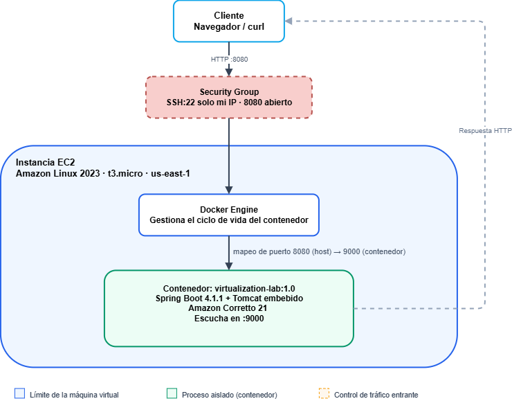

# VirtualizationLaboratorio

Aplicación web pequeña hecha en Java con Spring Boot, que expone un endpoint de saludo. Este repositorio documenta el taller completo de contenerización y despliegue: desde el código de la app hasta su despliegue final en AWS EC2, pasando por Docker, Docker Compose y Docker Hub.

## 1. Código fuente completo

La aplicación es deliberadamente simple, dos clases nada más, dentro del paquete `co.edu.eci.virtualizationlaboratorio`:

- **`RestServiceApplication`**: clase principal, anotada con `@SpringBootApplication`. Lee el puerto de escucha desde la variable de entorno `PORT`, y si esa variable no está definida, usa 9000 por defecto.
- **`HelloRestController`**: controlador REST. Expone un solo endpoint, `GET /greeting`, que recibe un parámetro opcional `name` (por defecto `World`) y responde con un saludo tipo `Hello, {name}!`.

```
co.edu.eci.virtualizationlaboratorio
├── RestServiceApplication.java   (punto de entrada, configuración de puerto)
└── HelloRestController.java      (endpoint /greeting)
```

Stack usado: Java 21, Maven, Spring Boot 4.1.1, Docker y Docker Compose, MongoDB 8, la imagen base Amazon Corretto 21 para el contenedor, y una instancia EC2 con Amazon Linux 2023 para el despliegue final.

## 2. Dockerfile y compose.yaml

El `Dockerfile`, en la raíz del repo, empaqueta la app como imagen usando Amazon Corretto 21 como base, copia el jar generado por Maven, y expone el puerto configurable por la variable `PORT` (9000 por defecto).

El `compose.yaml`, también en la raíz, orquesta dos servicios: la app web (`web`) y una base de datos MongoDB 8 (`db`), con volúmenes persistentes para los datos de Mongo. La app todavía no persiste nada en Mongo, el servicio de base de datos está ahí con un propósito pedagógico: practicar cómo Docker Compose administra varios servicios a la vez, cómo se comunican por red interna (usando el nombre del servicio, `db`, como hostname), y cómo funcionan los volúmenes persistentes.

Ambos archivos están disponibles completos en la raíz de este repositorio: [`Dockerfile`](./Dockerfile) y [`compose.yaml`](./compose.yaml).

## 3. Instrucciones paso a paso: build, ejecución, contenerización y despliegue

### 3.1 Build (construir la aplicación)

1. Clona el repositorio y ubícate en la raíz del proyecto (donde está `pom.xml`).
2. Compila y empaqueta con Maven:
   ```bash
   mvn clean package
   ```
3. Esto genera el jar ejecutable en `target/`, con nombre `VirtualizationLaboratorio-1.0-SNAPSHOT.jar` (o similar, según la versión del pom).

### 3.2 Ejecución local (sin Docker)

1. Corre el jar generado en el paso anterior:
   ```bash
   java -jar target/*.jar
   ```
2. Espera a ver en la consola la línea `Tomcat started on port 9000`.
3. Prueba el endpoint desde el navegador o con curl:
   ```
   http://localhost:9000/greeting?name=Pedro
   ```
4. La respuesta esperada es `Hello, Pedro!`.

Evidencia de la ejecución local respondiendo en el navegador:


Y la misma prueba hecha con curl desde la terminal:


### 3.3 Contenerización (Docker)

1. Con el `Dockerfile` en la raíz del repo, construye la imagen (reemplaza `<usuario>` por tu usuario de Docker Hub):
   ```bash
   docker build -t <usuario>/virtualization-lab:1.0 .
   ```
2. Verifica que la imagen quedó creada:
   ```bash
   docker images
   ```
3. Corre un contenedor a partir de esa imagen, mapeando el puerto interno 9000 a un puerto del host:
   ```bash
   docker run -d --name virtualization-lab-1 -p 34000:9000 <usuario>/virtualization-lab:1.0
   ```
4. Prueba el endpoint contenerizado:
   ```
   http://localhost:34000/greeting?name=Container
   ```

Evidencia de los comandos usados durante el build:


Y evidencia de que la imagen quedó construida correctamente:


**Demostrando aislamiento entre contenedores.** Para comprobar que cada contenedor corre completamente aislado del resto, aunque compartan la misma imagen base, se levantaron tres instancias al mismo tiempo:

```bash
docker run -d --name virtualization-lab-2 -p 34001:9000 <usuario>/virtualization-lab:1.0
docker run -d --name virtualization-lab-3 -p 34002:9000 <usuario>/virtualization-lab:1.0
```

Los tres respondieron de forma independiente, cada uno en su propio puerto (34000, 34001, 34002), sin interferirse entre sí.

Evidencia de los tres contenedores corriendo en paralelo:


Y evidencia de que cada uno responde por separado:


**Docker Compose (app + MongoDB).** Para levantar la app junto a MongoDB con un solo comando:

1. Desde la raíz del repo, con `compose.yaml` presente:
   ```bash
   docker compose up -d --build
   ```
2. Verifica que ambos servicios quedaron arriba:
   ```bash
   docker compose ps
   ```
3. Prueba el endpoint web (mapeado en el puerto 8087):
   ```
   http://localhost:8087/greeting?name=Compose
   ```
4. Para comprobar que MongoDB funciona, entra a su shell interactiva:
   ```bash
   docker compose exec db mongosh
   ```
5. Dentro de la shell, inserta y consulta un documento de prueba:
   ```javascript
   use workshop
   db.messages.insertOne({ message: "Hello from Docker Compose" })
   db.messages.find()
   ```

Evidencia de ambos servicios corriendo:


Evidencia del endpoint respondiendo vía Compose:


Y evidencia de la inserción y consulta en mongosh:


**Publicación en Docker Hub.**

1. Inicia sesión:
   ```bash
   docker login
   ```
2. Etiqueta la imagen también como `latest`:
   ```bash
   docker tag <usuario>/virtualization-lab:1.0 <usuario>/virtualization-lab:latest
   ```
3. Publica ambas versiones:
   ```bash
   docker push <usuario>/virtualization-lab:1.0
   docker push <usuario>/virtualization-lab:latest
   ```

Repositorio publicado: [hub.docker.com/r/marianaveloza/virtualization-lab](https://hub.docker.com/r/marianaveloza/virtualization-lab), con los tags `1.0` y `latest`.

Evidencia del repositorio publicado:


Y evidencia de los tags disponibles:


### 3.4 Despliegue en AWS EC2

1. Crea una instancia EC2 con Amazon Linux 2023 (en este taller se usó `t3.micro`).
2. Configura el security group: puerto 22 (SSH) restringido solo a tu IP, y puerto 8080 abierto al público (por ahí se expone la app).
3. Conéctate por SSH:
   ```bash
   ssh -i <tu-llave>.pem ec2-user@<ip-publica-de-la-instancia>
   ```
4. Instala Docker manualmente:
   ```bash
   sudo yum update -y
   sudo yum install -y docker
   sudo service docker start
   sudo usermod -a -G docker ec2-user
   ```
5. Cierra sesión y vuelve a conectarte para que el cambio de grupo surta efecto.
6. Descarga la imagen publicada y corre el contenedor:
   ```bash
   docker pull <usuario>/virtualization-lab:1.0
   docker run -d --name virtualization-lab --restart unless-stopped \
     -e PORT=9000 -p 8080:9000 <usuario>/virtualization-lab:1.0
   ```
7. Prueba el servicio desde tu propia máquina (no desde la instancia):
   ```
   http://<ip-publica-de-la-instancia>:8080/greeting?name=AWS
   ```

La respuesta esperada es `Hello, AWS!`.

> Nota: como la instancia no tiene una Elastic IP asignada, la IP pública cambia cada vez que se detiene y se vuelve a encender. Si el link de abajo ya no responde, es por eso, no porque el despliegue haya fallado.

## 4. URL del repositorio en Docker Hub

[hub.docker.com/r/marianaveloza/virtualization-lab](https://hub.docker.com/r/marianaveloza/virtualization-lab)

## 5. Evidencia de ejecución local

Ver sección 3.2 arriba (`HolaPedro.png`, `HolaPedroCurl.png`).

## 6. Evidencia de la imagen construida y los contenedores corriendo

Ver sección 3.3 arriba (`comandosShell.png`, `dockerImages.png`, `contenedoresParalelo.png`, `urlParalelo.png`).

## 7. Evidencia de la imagen en Docker Hub

Ver sección 3.3 arriba (`dockerHub.png`, `dockerHubTags.png`).

## 8. Evidencia del despliegue exitoso en EC2

Evidencia del endpoint respondiendo desde la instancia de EC2:


Y evidencia del contenedor corriendo dentro de la instancia:


## 9. URL pública de despliegue

`http://54.164.85.248:8080/greeting?name=AWS`

(la IP puede cambiar si la instancia se detuvo y se volvió a encender, ver nota en la sección 3.4)

## 10. Diagrama del modelo de despliegue y análisis de costos

### Diagrama del modelo de despliegue

El flujo completo de una solicitud, desde que sale del cliente hasta que llega a la aplicación:



Cada capa cumple un rol distinto. La instancia EC2 provee los recursos aislados de cómputo, memoria, almacenamiento y red, y se paga por hora de uso independientemente de cuánto tráfico reciba. Docker Engine es el motor que corre sobre esa máquina y levanta el contenedor. El contenedor en sí es un entorno de ejecución portable que ya trae empaquetada tanto la aplicación como sus dependencias de runtime, así que se comporta igual sin importar en qué máquina se corra. Dentro de ese contenedor vive la aplicación Java, que procesa la solicitud HTTP y devuelve la respuesta. El security group decide qué tráfico entrante puede siquiera llegar a tocar la máquina virtual.

### Análisis de costos

La AWS Pricing Calculator no ofrecía `t3.micro` como instancia seleccionable en la región usada al momento de hacer el cálculo, así que los números de esta tabla están calculados usando `t3.medium` como referencia. La instancia real que corre en EC2 sí es una `t3.micro`, más pequeña y más barata que lo que muestra la tabla, así que estos valores deben tomarse como un techo. La calculadora también quedó en la región US East (Atlanta) en vez de US East (N. Virginia), donde realmente vive la instancia, pero la diferencia de precio entre ambas regiones dentro de US East es mínima.

Evidencia de la estimación hecha en la AWS Pricing Calculator:


Supuestos comunes a los tres escenarios: la aplicación corre de forma continua, las 730 horas que tiene un mes en promedio, el almacenamiento usado es EBS tipo gp3, y la tarifa aplicada es on demand, sin ninguna reserva ni compromiso de uso a futuro. Como el endpoint `/greeting` devuelve un texto corto, la transferencia de datos es prácticamente insignificante incluso en el escenario de mayor tráfico.

| Escenario | Solicitudes al mes | Instancias | Horas al mes | Almacenamiento EBS | Transferencia saliente | Costo mensual estimado | Costo por solicitud | Principal factor de costo |
|---|---|---|---|---|---|---|---|---|
| Carga pequeña | 10,000 | 1 x t3.medium | 730 | 8 GB | aprox. 1 GB | aprox. 38.69 USD | aprox. 0.00387 USD | Tiempo de ejecución de la instancia (costo fijo) |
| Carga media | 100,000 | 1 x t3.medium | 730 | 10 GB | aprox. 5 GB | aprox. 39.21 USD | aprox. 0.00039 USD | Tiempo de ejecución de la instancia (costo fijo) |
| Carga grande | 1,000,000 | 2 x t3.medium | 730 cada una | 20 GB cada una | aprox. 50 GB | aprox. 83.62 USD | aprox. 0.00008 USD | Capacidad adicional para alta disponibilidad |

**Por qué un despliegue en EC2 tiene un costo base incluso con pocas solicitudes.** Se paga por tener la máquina encendida y reservada, no por cada solicitud procesada. Una instancia corriendo las 730 horas de un mes cuesta lo mismo si recibe diez solicitudes que si recibe diez mil, porque el cómputo, la memoria y el almacenamiento están disponibles todo ese tiempo, se usen o no a plena capacidad.

**En qué nivel de carga ese costo fijo deja de pesar tanto.** El costo por solicitud cae de unos 0.0039 dólares a unos 0.00008 dólares entre el escenario pequeño y el grande, casi cincuenta veces menos, simplemente porque el mismo costo fijo mensual se reparte entre muchísimas más solicitudes. A partir de varios cientos de miles de solicitudes al mes, ese costo fijo por instancia se vuelve prácticamente irrelevante por solicitud individual.

**Qué obligaría a pasar de una instancia a varias.** Principalmente dos motivos: que una sola instancia ya no dé abasto con la carga real de CPU o memoria, o la necesidad de alta disponibilidad, porque si solo hay una instancia y esa se cae, todo el servicio se cae con ella. En el escenario de carga grande se justificaron dos instancias no tanto por CPU, sino por redundancia.

**Qué otros servicios necesitaría un despliegue de producción real.** Un balanceador de carga para repartir tráfico y dar failover, una base de datos administrada en vez de una corriendo suelta en un contenedor, monitoreo y alertas con algo como CloudWatch, respaldos automáticos, y un registro de contenedores privado como ECR en vez de depender de un repositorio público en Docker Hub.

**Si sería más barato un despliegue serverless para la carga pequeña.** Casi con seguridad sí. Con apenas diez mil solicitudes al mes, un servicio como AWS Lambda cobraría por invocación y por tiempo real de ejecución, que para un endpoint tan liviano sería cuestión de milisegundos, así que probablemente ni siquiera saldría de la capa gratuita de Lambda. EC2 cobra por tener la instancia completa disponible, se use o no. Esa diferencia se reduce a medida que el tráfico crece y se vuelve constante, porque ahí empieza a convenir más tener capacidad reservada que pagar por invocación.

**Conclusión.** Para el escenario de carga pequeña, EC2 termina siendo una opción cara comparada con alternativas serverless, porque implica pagar por una máquina encendida las 24 horas del día para atender apenas unas cuantas solicitudes por hora. A medida que el volumen crece, ese costo fijo se diluye y EC2 se vuelve más competitivo, además de dar control total sobre el entorno de ejecución. Para los fines de este taller, con tráfico bajo, EC2 cumple el objetivo de aprendizaje de entender el modelo de despliegue basado en máquina virtual más contenedor, aunque en un escenario real con ese mismo volumen probablemente no sería la opción más eficiente en costos.

https://youtu.be/_Aaw-UqlgsY